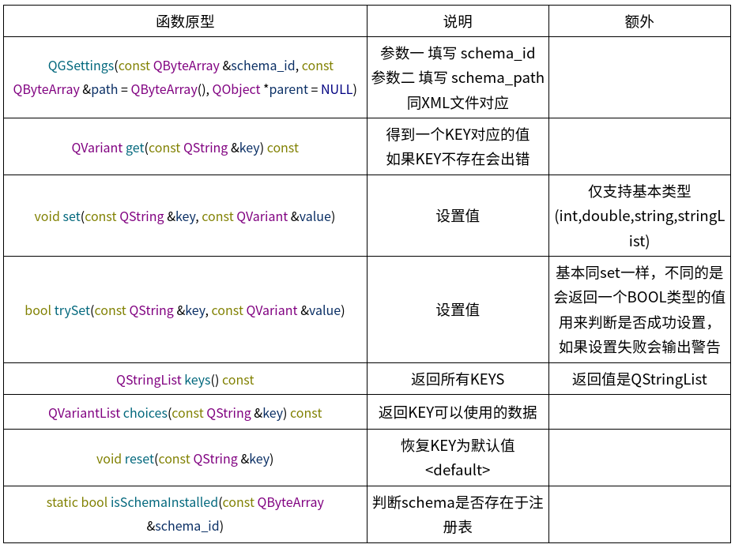

# QGSettings使用

> **提问：QGSetting 和 QSettings 的区别?**  
> 1. QGsetting 是专门用于 GNOME 桌面环境的设置管理器，而 QSettings 则是 Qt 框架自带的通用设置管理器。  
> 2. QGsetting 提供了一种与 GNOME 桌面环境集成的管理器，可以访问和修改 GNOME 桌面环境一些特定的设置，如主题、壁纸、字体等；而 QSettings 则适用于在 Qt 程序中管理任意的配置信息。  
> 3. QGsetting 使用 D-Bus 与 GNOME 集成，而 QSettings 通常使用 INI、XML、JSON 等格式的文件进行数据存储。  
> 4. QSettings 可以在不同的平台（如 Windows、Linux、Mac OS X 等）进行使用，而 QGsetting 只能在支持 GNOME 的 Linux 发行版上使用。  
> 5. 在使用中，QGsetting 更加接近 UNIX 哲学，即一个工具只做好一件事情，而 QSettings 更加通用，并且有更多可定制的选项。

- GSettings为GNOME桌面环境中提供的一种读取配置文件的方法
- dconf作为GSettings的后端是一个简单的底层配置存储管理系统，可以使用图形化的dconf-editor根据path来检索GSettings并管理key，而且支持在key发生改变时发出通知(changed信号)
- 命令行工具gsettings提供了对GSetings的命令行操作，可以查询、读取和设置键值

## 开发说明

1. 确认开发库安装
```shell
$ sudo apt install libgsettings-qt-dev
```

2. 在Qt的工程文件.pro中，需要加入如下两行：
```
CONFIG += link_pkgconfig
PKGCONFIG += gsettings-qt
```

使用GSettings代码参考：[myEpidemicPreventionClient中QGSettings的使用](https://gitee.com/xlinlin/myepidemicprevention/tree/master/myEpidemicPreventionClient)

3. QGSettings函数说明：


## 配置说明

GSettings的配置文件是xml格式的，文件需以.gschema.xml结尾，一个配置文件里面可以包含多个schema，每个schema可由多个key组成

一个配置例子如下：

```xml
<?xml version="1.0" encoding="UTF-8"?>
<schemalist>
    <schema path="/com/deepin/personnel/info/" id="com.deepin.personnel.info">
        <key type="s" name="name">
            <default>""</default>
            <summary>User name</summary>
            <description>User name</description>
        </key>
        <key type="i" name="age">
            <default>0</default>
            <summary>Age</summary>
            <description>Age</description>
        </key>
        <key type="s" name="id">
            <default>""</default>
            <summary>Id card</summary>
            <description>Id card</description>
        </key>
        <key type="s" name="address">
            <default>""</default>
            <summary>Address</summary>
            <description>Address</description>
        </key>
    </schema>
</schemalist>
```

详细说明：  
- id: schema中的id在整个配置系统中是唯一的，否则在执行glib-compile-schemas时会忽略重复的id的开头通常使用与应用相关的域名
- path: schema中的path必须是以/开头并且以/结尾，不能包含连续的/，path用于指定在storage中存储路径，可以与id不一致
- name: key的名称，需要在此schema中唯一，name的值由小写字母、数字和-组成，并且开头必须是小写字母，不能以-结尾，也不能出现连续的-
- type: key的类型，需要是GVariant支持的类型，除了可以使用基本的类型外，也可按照GVariant的方式组合类型
- default: key的默认值
- summary: key的简单描述
- description: key的详细描述

要想schema文件被GSettings使用，还需要借助编译器glib-compile-schemas将schema文件编译为二进制文件。GSettings读取XDG_DATA_DIRS下的glib-2.0/schemas路径，需要将schema文件放到环境变量XDG_DATA_DIRS/glib-2.0/schemas/路径下，一般为/usr/share/glib-2.0/schemas和/usr/local/share/glib-2.0/schemas，所以在程序运用前一般需要做如下操作：

```shell
$ sudo install -m 0644 com.deepin.personnel.info.gschema.xml /usr/share/glib-2.0/schemas
$ sudo glib-compile-schemas /usr/share/glib-2.0/schemas/
```


## 工具使用

可视化工具下载：
```shell
$ sudo apt install dconf-editor
```

命令行工具：  

| 命令 | 说明 |
| ---- | --- |
| gsettings list-schemas | 显示系统已安装的不可重定位的schema(已安装并已安装并有固定path的 schema) |
| gsettings list-relocatable-schemas | 显示已安装的可重定位的schema(已安装却没有固定path的 schema) |
| gsettings list-children SCHEMA | 显示指定schema的children，其中SCHEMA为xml文件中schema的id属性值，如示例代码中daemon的”apps.eightplus.qgsettings-demo” |
| gsettings list-keys SCHEMA | 显示指定schema的所有项(key) |
| gsettings range SCHEMA KEY | 查询指定schema的指定项KEY的有效取值范围 |
| gsettings get SCHEMA KEY | 显示指定schema的指定项KEY的值 |
| gsettings set SCHEMA KEY VALUE | 设置指定schema的指定项KEY的值为VALUE |
| gsettings reset SCHEMA KEY | 恢复指定schema的指定项KEY的值为默认值 |
| gsettings reset-recursively SCHEMA | 恢复指定schema的所有key的值为默认值 |
| gsettings list-recursively [SCHEMA] |	如果有SCHEMA参数，则递归显示指定schema的所有项(key)和值(value)，如果没有SCHEMA参数，则递归显示所有schema的所有项(key)和值(value) |


## 参考链接

[Qt配置文件之QGSettings](https://eightplus.github.io/2019/11/07/2019-11-07-qgsettings/)

