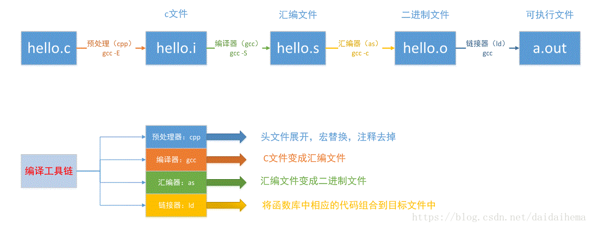
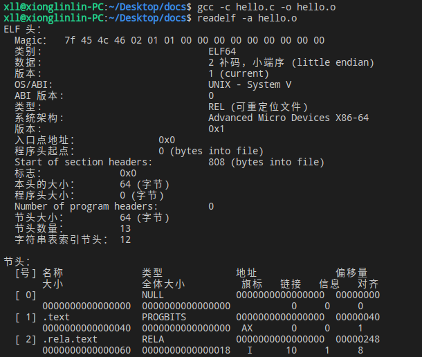
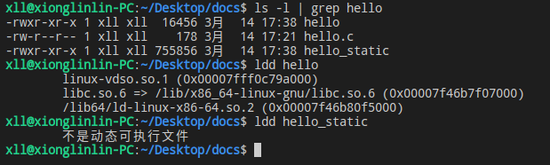

# GCC编译器

## 一. GCC工具链

> GCC的官网地址为: https://gcc.gnu.org/  
> Binutils工具集官网: https://www.gnu.org/software/binutils/

GCC编译工具链（toolchain），是指以GCC编译器为核心的一整套工具。它主要包含以下三部分内容：
- gcc-core: 即GCC编译器，用于完成预处理和编译过程，把C代码转换成汇编代码
- Binutils: 除GCC编译器外的一系列二进制工具集包括了链接器ld，汇编器as、目标文件格式查看器readelf等，如果没有这些工具，GCC编译器将无法正常工作
- glibc: 包含了主要的C语言标准函数库，C语言中常常使用的打印函数printf、malloc函数就在glibc库中，在Ubuntu系统下，libc.so.6是glibc的库文件

Binutils常用工具：
- as: 汇编器，把汇编语言代码转换为机器码（目标文件）
- ld: 链接器，把编译生成的多个目标文件组织成最终的可执行程序文件
- readelf: 可用于查看目标文件或可执行程序文件的信息
- nm: 可用于查看目标文件中出现的符号
- objcopy: 可用于目标文件格式转换，如.bin 转换成 .elf 、.elf 转换成 .bin等
- objdump: 可用于查看目标文件的信息，最主要的作用是反汇编
- size: 可用于查看目标文件不同部分的尺寸和总尺寸，例如代码段大小、数据段大小、使用的静态内存、总大小等


## 二. gcc命令和g++命令的区别

**误区：**
在工作中，我们习惯使用 gcc 指令编译 C 语言程序，用 g++ 指令编译 C++ 代码，但这并不是他们他们之间的区别

**区别在于：**
- gcc 指令：只要是 GCC 支持编译的程序代码，都可以使用 gcc 命令完成编译。可以这样理解，gcc 是 GCC 编译器的通用编译指令，gcc 可以根据程序文件的后缀名，自行判断出当前程序所用编程语言的类别
- g++ 指令：无论目标文件的后缀名是什么，该指令都一律按照编译 C++ 代码的方式编译该文件，也就是说，对于 .c 文件来说，gcc 指令以 C 语言代码对待，而 g++ 指令会以 C++ 代码对待，对于 .cpp 文件来说，gcc 和 g++ 都会以 C++ 代码的方式编译。

**那为何有时用 gcc 指令编译 C++ 代码会出错呢？**

因为很多 C++ 程序都会调用某些标准库中现有的函数或者类对象，而单纯的 gcc 命令是无法自动链接这些标准库文件的，如果要用 gcc 命令，我们需要加上一些参数，如编译 hello.cpp 文件，我们可以使用：

```shell
# 方式一
g++ hello.cpp
# 方式二
gcc -xc++ -lstdc++ -shared-libgcc hello.cpp
# -xc++ 选项表示：以编译C++代码的方式编译文件
# -lstdc++ -shared-libgcc 选项表示：gcc在编译C++程序时可以链接必要的C++标准库
```
可以简单这样认为：
```shell
g++ = gcc -xc++ -lstdc++ -shared-libgcc
# 显然后者书写是非常麻烦的，大多数人会更喜欢前者
```

## 二、GCC编译过程

C 或者 C++ 程序从源代码生成可执行程序的过程，需经历 4 个过程：

- **预处理(Pre-Processing)：** 主要是处理那些源文件和头文件中以 # 开头的命令（比如 #include、#define、#ifdef 等），并删除程序中所有的注释 // 和 /*...*/
- **编译(Compiling)：** 就是将预处理得到的程序代码，经过一系列的词法分析、语法分析、语义分析以及优化，加工为当前机器支持的汇编代码
- **汇编(Assembling)：** 是将汇编代码转换成可以执行的机器指令。大部分汇编语句对应一条机器指令，有的汇编语句对应多条机器指令。相对于编译操作，汇编过程会简单很多，它并没有复杂的语法，也没有语义，也不需要做指令优化，只需要根据汇编语句和机器指令的对照表一一翻译即可
- **链接(Linking)：** 把多个二进制的目标文件（object file）链接成一个单独的可执行文件



### 预处理阶段

**使用 -E 选项，生成 .i 文件**

默认情况下 gcc -E 指令只会将预处理操作的结果输出到屏幕上，并不会自动保存到某个文件。因此该指令往往会和 -o 选项连用，将结果导入到指令的文件中，例：

```shell
$ gcc -E hello.c -o hello.i
$ ls
hello.c hello.i
```

### 编译阶段

**使用 -S 选项，生成 .s 文件**  

gcc -S 指令即可以操作预处理后的 .i 文件，也可以操作 .c 或 .cpp 源代码文件，最终通过编译成为汇编语言，生成.s文件，在这个过程，GCC会检查各个源文件的语法，即使我们调用了一个没有定义的函数，也不会报错

- 如果操作对象为 .i 文件，则 GCC 编译器只需编译此文件
- 如果操作对象为 .c 或者 .cpp 源代码文件，则 GCC 编译器会对其进行预处理和编译这 2 步操作

例：

```shell
# 编译的结果会默认保持到同名的.s文件中
$ gcc -S hello.i
$ ls
hello.c hello.i hello.s
# 用-o选项指定保存的文件名
$ gcc -S hello.i -o hello.s
# 从 hello.c 文件直接得到对应的汇编文件
$ gcc -S hello.c -o hello.s
```

### 汇编阶段

**使用 -c 选项，生成 .o 文件**

gcc -c 选项只是令 GCC 编译器将指定文件加工至汇编阶段,生成 .o 目标文件，但不执行链接操作，经过编译汇编之后，生成的目标文件包含着机器代码，这部分代码就可以直接被计算机执行  

例：分别将 hello.c、hello.i、hello.s 编译至目标文件

```shell
$ ls
hello.c  hello.i  hello.s
$ gcc -c hello.c -o hello.o
$ gcc -c hello.i -o helloi.o
$ gcc -c hello.s -o hellos.o
```

Linux下生成的目标文件(.o)、动态库文件(.so)以及链接阶段生成的可执行文件都是elf格式的， 可以使用 readelf 工具来查看它们的内容

```shell
$ readelf -a hello.o
```


从 readelf 的工具输出的信息，可以了解到目标文件包含ELF头、程序头、节等内容， 对于*.o目标文件或*.so库文件，编译器在链接阶段利用这些信息把多个文件组织起来，对于可执行文件，系统在运行时根据这些信息加载程序运行

### 链接阶段

把多个二进制的目标文件(.o文件)链接起来生成一个单独的可执行文件，这是链接器ld完成的工作。

例如一个工程里包含了A和B两个代码文件，在链接阶段，链接过程需要把A和B之间的函数调用关系理顺，也就是说要告诉A在哪里能够调用到fun函数，建立映射关系，所以称之为链接。若链接过程中找不到fun函数的具体定义，则会链接报错。

如果一个hello.c文件调用了C标准代码库的printf函数，链接器也会把它和printf函数链接起来，生成最终的可执行文件。

链接分为两种：  
- 动态链接：GCC编译时的默认选项。动态是指在应用程序运行时才去加载外部的代码库，不同的程序可以共用代码库。所以动态链接生成的程序比较小，占用较少的内存。
- 静态链接：链接时使用选项 “--static”，它在编译阶段就会把所有用到的库打包到自己的可执行程序中。所以静态链接的优点是具有较好的兼容性，不依赖外部环境，但是生成的程序比较大。

例：

```shell
# 动态链接，生成名为hello的可执行文件
$ gcc hello.o –o hello
# 也可以直接使用C文件一步生成，与上面的命令等价
$ gcc hello.c -o hello
 ​
# 静态链接，使用--static参数，生成名为hello_static的可执行文件
$ gcc hello.o –o hello_static --static ​
# 也可以直接使用C文件一步生成，与上面的命令等价
$ gcc hello.c -o hello_static --static
```

使用 ldd 工具查看动态文件的库依赖：



图片可知，使用动态链接比使用静态链接程序会小很多，而且动态链接生成的hello程序依赖于库文件linux-vdso.so.1、libc.so.6 以及ld-linux-x86-64.so.2，其中的libc.so.6就是我们常说的C标准代码库， 我们的程序中调用了它的printf库函数，静态链接生成的hello_static没有依赖外部库文件

## 三、常用的编译选项

-L：指定链接库目录  
-l(小写L)：添加链接库  
-I(大写i)：指定头文件路径

> 标准库的大部分函数通常放在文件 libc.a 中（静态链接库），或者放在用于共享的动态链接文件 libc.so 中，这些链接库一般位于 /lib/ 或 /usr/lib/，或者位于GCC默认搜索的其他目录。当使用 GCC 编译和链接程序时，GCC 默认会链接 libc.a 或者 libc.so，但是对于其他的库（例如非标准库、第三方库等），就需要手动添加。

例：

```shell
$ gcc -o hello hello.c -I./hello/include -L./hello/lib -lworld

# 标准头文件 <math.h> 对应的数学库默认不会被链接，如果用到里面的函数，就需要手动添加连接库
# 这里 -L/usr/lib 可写可不写，因为该目录会被默认搜索
$ gcc hello.c -o hello -L/usr/lib -lm

# 也可以直接指定库的绝对路径
$ gcc hello.c -o hello /usr/lib/libm.a
```

-g：生成的可执行程序可以使用gdb调试  
-O0: 不做任何优化，这是默认的编译选项  
-O1: O1等级编译优化选项  
-O2: O2等级编译优化选项  
-w：不生成任何警告信息  
-Wall：允许发出gcc提供的所有有用的报警信息  
-werror ：把所有的告警信息转化为错误信息，并在告警发生时终止编译过程  
-D：编译时设置宏

```shell
$ gcc test.c -o test -DTRUE // 相等于在代码第一行定义 #define TRUE 1
$ gcc test.c -o test -Dmacro=string // 代码第一行定义 #define macro string
```

-std：指定gcc编译标准

```shell
$ gcc test.c -o test // 默认gcc test.c -o test -std=gun89
```

## 四、GCC静态链接库

### 创建静态链接库

1. 将所有指定的源文件，都编译成相应的目标文件

```shell
$ gcc -c 源文件1 源文件1
```

2. 使用 ar 压缩指令，将生成的目标文件打包成静态链接库，其基本格式如下：
```shell
ar rcs 静态链接库名称 目标文件1 目标文件2 ...
```

例：将add.c、sub.c、test.h几个文件打包成libtest.a

```shell
$ ls
add.c sub.c test.h
$ gcc -c add.c sub.c
$ ar rcs libtest.a add.o sub.o
$ ls
add.c add.o libtest.a sub.c sub.o test.h
```

ar 是 Linux 的一个备份压缩命令，它可以将多个文件打包成一个备份文件（也叫归档文件），也可以从备份文件中提取成员文件。ar 命令最常见的用法是将目标文件打包为静态链接库  
参数的说明：
- r: 用来替换库中已有的目标文件，或者加入新的目标文件
- c: 表示创建一个库。不管库否存在，都将创建
- s: 用来创建目标文件索引，这在创建较大的库时能提高速度

### 使用静态链接库

-static：表示链接时使用静态库，若无该选项则默认使用动态库

直接指定静态库文件名

```shell
$ gcc -static main.c -o main ./libtest.a
```

使用-L和-l链接

```shell
$ gcc -static main.c -o main -L. -ltest 
```

## 五、GCC动态链接库

### 生成动态链接库

-fPIC：表示生成与位置无关代码  
-shared：表示生成共享库(即动态库)

```shell
$ gcc -fPIC -shared -o libmyshare.so add.c sub.c
$ ls
add.c libmyshare.so sub.c test.h
```
### 使用动态链接库

直接指定动态库绝对路径和文件名

```shell
$ gcc main.c -o main ./libmyshare.so
```

使用-L和-l链接

```shell
$ gcc main.c -o main -L. -lmyshare
```

### 动态链接库查找过程

Linux的动态链接库绝大多数都在/lib和/usr/lib下，操作系统也会默认去这两个路径下搜索动态链接库。另外，/etc/ld.so.conf文件里可以配置路径，/etc/ld.so.conf文件会告诉操作系统去哪些路径下搜索动态链接库。这些位置的动态链接库很多，如果链接器每次都去这些路径遍历一遍，非常耗时，Linux提供了ldconfig工具，这个工具会对这些路径的动态链接库按照SONAME规则创建软连接，同时也会生成一个缓存Cache到/etc/ld.so.cache文件里，链接器根据缓存可以更快地查找到各个.so文件。每次在/lib和/usr/lib这些路径下安装了新的库，或者更改了/etc/ld.so.conf文件，都需要调用ldconfig命令来做一次更新，重新生成软连接和Cache。但是/etc/ld.so.conf文件和ldconfig命令最好使用root账户操作。

对于非root用户，另一种方法是使用LD_LIBRARY_PATH环境变量，LD_LIBRARY_PATH存放着若干路径，链接器会去这些路径下查找库，非root可以将某个库安装在了一个非root权限的路径下，再将其添加到环境变量中。

动态链接库的查找先后顺序为：

- LD_LIBRARY_PATH环境变量中的路径
- /etc/ld.so.cache缓存文件
- /usr/lib 和 /lib


### 解决找不到链接库的方法

在 Windows 下链接动态库得到可执行文件后，可以直接执行，而在 Linux 下却会发生找不到动态库的问题

```shell
$ ./main
./main: error while loading shared libraries: libmyshare.so: cannot open shared object file: No such file or directory
```

这里涉及到一个“编译时库查找”和“运行时库查找”问题

- 编译时库查找：如前所述，在命令行里使用 -L 和 -l 选项即可
- 运行时库查找：在Linux下却是去默认的动态库查找路径下查找，我们构建出的动态库还没放到里面，自然是找不到的

使用ldd命令查看当前的链接库情况

```shell
$ ldd main
        linux-vdso.so.1 (0x00007ffed5bbf000)
        libmyshare.so => not found
        libc.so.6 => /lib/x86_64-linux-gnu/libc.so.6 (0x00007fe478693000)
        /lib64/ld-linux-x86-64.so.2 (0x00007fe47887a000)
```

**解决方法**

第一种方法：  
export LD_LIBRARY_PATH=自定义动态库的路径（只能起到临时作用，关闭终端后失效）  
LD_LIBRARY_PATH：指定查找共享库（动态链接库）时除了默认路径之外的其他路径，该路径在默认路径之前查找

```shell
$ export LD_LIBRARY_PATH=/home/xll/test/
$ ./main 
```

第二种方法：  
将 export LD_LIBRARY_PATH=自定义动态库的路径 命令写入home目录下的.bashrc文件中，保存后重启终端生效（永久）
```shell
$ cat ~/.bashrc
...
export LD_LIBRARY_PATH=/home/xll/test/

$ source .bashrc
```

第三种方法：  
将 libmyshare.so 所在绝对路径追加入到 /etc/ld.so.conf 文件，使用 sudo ldconfig -v 更新

```shell
$ sudo vim /etc/ld.so.conf
$ cat /etc/ld.so.conf
include /etc/ld.so.conf.d/*.conf
/home/xlinlin/test/lib
$ sudo ldconfig -v
```

第四种方法：  
直接将动态库拷贝到 /usr/lib 的系统目录下


## 参考链接

[GCC基本使用](https://zhuanlan.zhihu.com/p/404682058)  
[GCC编译器30分钟入门教程](http://c.biancheng.net/gcc/)  
[C/C++构建静态库和动态库](https://www.cnblogs.com/zwjason/p/17192463.html)  
[Linux的so文件到底是干嘛的？浅析Linux的动态链接库](https://zhuanlan.zhihu.com/p/235551437)